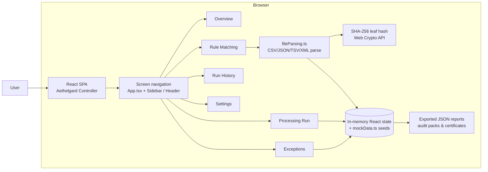

# Aethelgard Controller

**Autonomous Financial Intelligence & Multi-Source Reconciliation Command Center.**

A React single-page application that presents a complete front-end experience for deterministic multi-source financial reconciliation — ingesting ERP/clearing files, configuring field-level match rules, running a simulated live concordance pipeline, triaging penny-exact exceptions, and browsing an immutable audit history of batches.

## Access the Website : https://aethelgard-controller.vercel.app/

 

---

## Overview

Finance teams reconcile general-ledger records against settlement/clearing data from banks, ERPs and payment gateways. Traditional processes rely on heuristic matching, manual spreadsheet work, and arbitrary suspense write-offs to "make the books balance" — leaving unexplained variance that fails audit scrutiny.

Aethelgard Controller presents an interface built around the opposite premise: **mathematical certainty**. The application is a high-fidelity command center for:

- uploading ledger and settlement files (CSV, JSON, TSV, XML, TXT) and having formats auto-detected,
- configuring deterministic field-to-field match rules and monetary tolerance bounds,
- executing a live 4-stage reconciliation run with real-time progress and invariant checks,
- driving every unexplained delta to zero through auditable, plain-language exception memos,
- browsing a permanent, hash-anchored history of prior batch runs.

The intended audience is financial operations, treasury, and accounting teams (and the product/engineering teams building for them). The repository today delivers the complete interactive UI of that platform with simulated data; a production reconciliation engine is not part of this codebase.

## Features

All features below are implemented in the current source code.

### Ingestion & File Parsing
- Drag-and-drop (or browse) **CSV, JSON, TSV, XML, and TXT** transaction files (`New Ingestion` dialog and Rule Matching upload drawer).
- Client-side parsing with automatic format detection: CSV/TSV delimited ledger, JSON array / API stream, ISO-20022 XML (`camt.053` / `pain.002`), and fixed-width/plain text.
- Extracts headers, sample rows, record counts, and gross monetary totals per file.
- Computes a **real SHA-256 digest (Web Crypto API)** of each uploaded file, displayed as a "Merkle leaf" hash alongside the parsed metadata.
- Optional preloaded sample pair: a NetSuite GL journal vs. a Stripe settlement clearing file.

### Rule Matching & Tolerance Configuration
- Four default deterministic match criteria: **Amount / Value Parity**, **Reference ID Invariant**, **Date / Timestamp Bounds**, and **Entity / Currency Normalization**.
- **Auto-Match Headers** maps columns across the two uploaded files using keyword heuristics.
- Create **custom field-to-field rules** with selectable comparison operators (exact 1:1, bounded tolerance, sanitized token, temporal window); toggle rules active/bypassed, delete custom rules, and reset to defaults.
- Amount tolerance slider **$0.00–$100.00** plus a **Strict Zero-Penny (±$0.00)** mode, with a live invariants check showing Source A vs. Source B sums, delta, and whether the variance sits inside the tolerance window.

### Live Reconciliation Run (Simulation)
- Animated **4-stage concordance pipeline** (ingest → classify → quantify → explain / Merkle proof) with percentage progress, per-stage status, elapsed timer, and record counters.
- Pause / resume, fast-forward to 100%, and re-run controls.
- Uploaded-file panel with per-file metadata and inline sample-record preview; **Export Invariant Certificate** downloads a JSON report with reconciliation metrics and enclave attestation data.
- Three invariant verification panels: Conservation of Value, Bi-Directional Bijection, and Temporal Order.

### Reconciliation Command Center (Overview)
- Dashboard with live telemetry (measured concordance, unaccounted write-offs, cycle-close latency, invariant verification).
- Interactive ledger table with All / Concordant / Exceptions filter tabs.
- One-click **Post Reclass** and **Auto-Adjust** actions that resolve exceptions to concordant status with an audit trail label.
- **Export Ledger Audit Pack** (JSON download).

### Exceptions Triage Desk
- Six seeded exception memos, each with an exact-penny delta, a plain-language audit-ready explanation, and a governance clause reference (FASB ASC 830, ISO 20022 status codes, PCAOB standards, etc.).
- Category filters: **Contractual Holdback, FX Variance, Gateway Fee, Settlement Float, Metadata Mismatch**.
- Per-category resolution actions (Post Reclass, Auto-Adjust, Book Fee, Verify & Clear Hold, Override & Sign) plus batch approve-all; resolved exceptions transition to "Audit Sealed".

### Run History & Immutability
- Table of eight historical batches with search, source-pair filter, and pagination UI.
- Batch detail modal exposing the cryptographic proof vector (leaf/root hashes, pipeline, timestamp) and **Download Audit Certificate** (JSON).
- Export the full historical ledger archive as JSON.

### Simulation & Support Surfaces
- **Enclave Terminal**: an interactive operator console with a live log stream and working commands (`help`, `status`, `verify-merkle`, `export-audit`, `clear`).
- **In-app Documentation**: a four-tab product specification describing the 4-step engine, the three mathematical invariants, SGX/Merkle proof architecture, and ISO-20022 / institutional API integrations.
- **Settings**: enclave PRM memory allocation, dual-controller sign-off toggle, auto-reclassification ceiling, and an institutional connector status list.

## Tech Stack

| Category       | Technology |
| -------------- | ---------- |
| Frontend       | React 19, TypeScript, Vite 6 |
| Styling        | Tailwind CSS v4 (`@tailwindcss/vite`), custom CSS, Google Fonts (Inter, JetBrains Mono, Playfair Display), Material Symbols icons |
| Build Tooling  | Vite, esbuild, `tsx` |
| Runtime        | Browser Web Crypto API (SHA-256) |
| Backend        | None — client-side only (Express/`dotenv` are declared in `package.json` but not imported anywhere in `src/`) |
| Database       | None — seeded mock data (`src/data/mockData.ts`) + client-side file parsing |
| Authentication | Not implemented |
| APIs           | None — no server routes or network calls in the source |
| Deployment     | Scaffolded for Google AI Studio (see [Deployment](#deployment)); no Docker/CI config in the repo |

Dependencies declared in `package.json` but **not used** by the source code: `@google/genai`, `express`, `dotenv`, `lucide-react`, `motion`, `@types/express`.

## Architecture

Aethelgard Controller is a **client-side, single-page React application**. All state is held in React hooks at the root (`src/App.tsx`), which switches between six screen components and renders four modal components. There is no server, no router, and no external service calls.

- **Data layer**: seeded static models in `src/data/mockData.ts` (ledger rows, historical batches, default rules) plus runtime-generated data from `src/utils/fileParsing.ts` (file parsing, SHA-256 leaf hashing, sample pair generation).
- **State flow**: configured batches and uploaded files are lifted into `App.tsx` and passed down to the Rule Matching and Processing Run screens, so launching an ingestion or reconciliation run forwards the active configuration onward.
- **Output**: exports (audit pack, invariant certificate, audit certificate, ledger archive) are generated as JSON blobs and downloaded through the browser.



## Project Structure

```text
aethelgard-controller/
├── index.html                  # App shell, fonts, dark-theme root
├── metadata.json               # Google AI Studio app metadata
├── package.json                # Scripts & dependencies
├── tsconfig.json               # TypeScript config
├── vite.config.ts              # Vite + React + Tailwind plugin, HMR toggle
├── .env.example                # Documented env vars (AI Studio)
├── .gitignore
└── src/
    ├── main.tsx                # React entry point
    ├── App.tsx                 # Root state, screen switching, modals
    ├── index.css               # Tailwind import + global styles/scrollbar
    ├── types.ts                # Shared TypeScript models
    ├── data/
    │   └── mockData.ts         # Seeded ledger rows, batches, default rules
    ├── utils/
    │   └── fileParsing.ts      # File format detection, SHA-256 hashing, sample pair
    ├── components/
    │   ├── NavigationHeader.tsx# Top nav, telemetry, quick actions
    │   ├── Sidebar.tsx         # Collapsible desktop navigation
    │   ├── screens/            # The six main screens
    │   │   ├── PlatformOverview.tsx
    │   │   ├── RuleMatchingScreen.tsx
    │   │   ├── ProcessingRunScreen.tsx
    │   │   ├── RunHistoryScreen.tsx
    │   │   ├── ExceptionsScreen.tsx
    │   │   └── SettingsScreen.tsx
    │   └── modals/             # Dialogs & overlays
    │       ├── NewIngestionModal.tsx
    │       ├── BatchDetailModal.tsx
    │       ├── TerminalConsoleModal.tsx
    │       └── DocumentationModal.tsx
    └── public/assets/aistudio/ # AI Studio placeholder assets
```

**Key directories:**

- `src/components/screens/` — one screen per navigation item (Overview, Rule Matching, Processing Run, Run History, Exceptions, Settings).
- `src/components/modals/` — dialogs for new ingestion, batch detail, the enclave terminal, and in-app documentation.
- `src/data/` — seeded demonstration data that powers the overview ledger, run history, and default match rules.
- `src/utils/` — the real (non-simulated) parts of the app: file format parsing and SHA-256 hashing.

## Application Workflow

1. **Ingest** — From the "New Ingestion" dialog, upload one or more ledger/settlement files (or preload the sample NetSuite vs. Stripe pair). Each file is parsed client-side and hashed into a SHA-256 leaf.
2. **Configure** — In Rule Matching, auto-match or manually map columns and define up to four (or more, custom) deterministic criteria. Set the monetary tolerance window (or strict zero-penny mode) and confirm the delta sits inside bounds.
3. **Run** — Launch the reconciliation. The Processing Run screen animates the 4-stage concordance pipeline to a certificate report, with invariant results (conservation of value, bijection, temporal order).
4. **Triage** — Exceptions surfaced by the run are reviewed in the Exceptions Desk, each with a plain-language CPA-ready explanation and governance clause, and resolved via audited posting actions.
5. **Archive** — Completed runs appear in Run History with their hash vector; batch details can be re-inspected and audit certificates exported at any time.

**Data flow note:** because the platform is a front-end prototype, step 3's reconciliations are computed over the parsed file metadata (counts, gross sums, hash) and seeded records rather than a back-end reconciliation engine. The SHA-256 hashing, file parsing, tolerance math and export generation are all executed genuinely in the browser.

## Prerequisites

- **Node.js** (current LTS recommended) — the project targets modern module tooling (`type: "module"`, Vite 6, React 19).
- **npm** — the package manager used by the project scripts. No lockfile is committed, so `npm install` will resolve versions at install time.

## Installation

```bash
npm install
```

## Environment Variables

The repository ships a `.env.example` documenting two variables. These are intended for the Google AI Studio runtime, which injects them automatically.

```env
GEMINI_API_KEY="MY_GEMINI_API_KEY"
APP_URL="MY_APP_URL"
```

| Variable        | Purpose                                                                                             | Used by app code? |
| --------------- | --------------------------------------------------------------------------------------------------- | ----------------- |
| `GEMINI_API_KEY`| Gemini AI API key; injected at runtime from AI Studio user secrets.                                  | No — declared in `.env.example`/`metadata.json` only, never read in `src/`. |
| `APP_URL`       | Host URL of the deployed applet (Cloud Run service URL); used for self-referential links/API base.   | No — declared in `.env.example` only. |

Copy the example file to `.env.local` (or `.env`) and fill in values if you want the variables available in your local process. **The application itself does not currently read either variable.**

> Security: never commit real API keys. `.gitignore` excludes all `.env*` except `.env.example`.

## Database Setup

No database is used. All data is seeded in memory (`src/data/mockData.ts`) or produced by client-side parsing on upload. There are no migrations, ORMs, or seed scripts.

## Running Locally

Start the development server (port **3000**, bound to `0.0.0.0`):

```bash
npm run dev
```

Then open `http://localhost:3000`.

### Useful scripts

| Command              | Description                                                            |
| -------------------- | ---------------------------------------------------------------------- |
| `npm run dev`        | Start the Vite dev server on port 3000 with HMR.                        |
| `npm run build`      | Production build to `dist/`.                                            |
| `npm run preview`    | Preview the production build locally.                                   |
| `npm run lint`       | Run the TypeScript type-checker (`tsc --noEmit`). **Note:** this is a type check, not ESLint. |
| `npm run clean`      | Remove `dist/` and `server.js` (`rm -rf` — Unix shells only).           |

This is a single-command front-end app; there is no separately booted backend.

## API Documentation

The project does **not** expose a back-end API. There are no server routes, REST endpoints, or network calls in the source code — the application is fully client-side. (Data-exchangeable output is provided instead through the browser downloads described under [Features](#features).)

## Authentication & Authorization

**Not implemented.** The codebase contains no login, registration, sessions, tokens, or route protection. The "SESSION // 0x489F·PROD" / "ENC-RSA-4096" strings in the sidebar are static UI labels within the simulated enclave concept, not a real auth mechanism.

## Screenshots / Demo

No screenshots or demo assets exist in the repository (`public/` contains only an empty AI Studio placeholder directory), and no live deployment URL is configured in the repo. To experience the app, run it locally (see [Running Locally](#running-locally)).

## Testing

No test framework or test files are present. Testing has not yet been configured for this project. The closest verification currently available is the TypeScript type-check:

```bash
npm run lint
```

## Deployment

The repository was scaffolded as a **Google AI Studio** application:

- `metadata.json` declares the app name and a server-side Gemini capability flag (not exercised by code).
- `.env.example` documents variables that "AI Studio automatically injects at runtime" (Gemini API key, Cloud Run service URL).
- The original scaffold README linked an AI Studio applet URL.

No Dockerfile, CI workflow, or hosting configuration (Vercel/Render/AWS, etc.) is committed to the repository, so a self-service deployment process cannot be documented from the repo contents. The project is a standard Vite static build, so it can be deployed anywhere that serves static files:

```bash
npm run build
# serve the `dist/` directory from any static host
```

## Troubleshooting

- **Port 3000 already in use** — the dev server is hard-coded to `--port=3000`. Stop the conflicting process or change the port in the `dev` script in `package.json`.
- **`npm run clean` fails on Windows** — the script uses `rm -rf`, which is a Unix command. On Windows PowerShell, delete `dist`/`server.js` manually or use a shell (Git Bash/WSL).
- **The type-check (`npm run lint`) reports errors after editing** — the project uses a strict TypeScript config (`target: ES2022`, `noEmit`). Fix the reported types before building.
- **Environment variables appear unused** — `GEMINI_API_KEY` and `APP_URL` are documented for the AI Studio runtime but are never read by the application code; the app runs fine without them.
- **No lockfile committed** — dependency versions come from `package.json` semver ranges. If you need reproducible installs, consider generating and committing a lockfile (`npm install` creates `package-lock.json`).
- **HMR flicker during automated edits** — set `DISABLE_HMR=true` when running the dev server to disable hot reload and file watching (per `vite.config.ts`).

## Future Improvements

These are realistic next steps based on the current implementation; none are implemented today:

- Implement an actual reconciliation/matching engine (real record-level matching, not metadata simulation) behind a backend API.
- Add persistent storage (database) for batches, rules, and audit history; replace seeded `mockData` with connected records.
- Implement authentication and role-based authorization (e.g., operator vs. dual sign-off approver).
- Integrate with real institutional sources (NetSuite SuiteTalk, Stripe, ISO-20022) and drive the terminal/documentation claims with live integrations.
- Add a real immutable audit store or verifiable Merkle-tree implementation over persisted records.
- Add unit/integration tests (component and parsing-layer coverage) and set up CI.

## Contributing

Contributions are welcome. To contribute to this repository:

1. **Fork** the repository and create a feature branch (`git checkout -b feat/your-feature`).
2. Make your changes, keeping the existing code style, and verify with `npm run lint`.
3. **Commit** with a clear, descriptive message.
4. **Push** the branch and open a **Pull Request** describing the change, motivation, and any testing performed.

For bug reports and feature requests, please open an issue with a clear description of the expected vs. actual behavior.

## License

License has not been specified yet.
